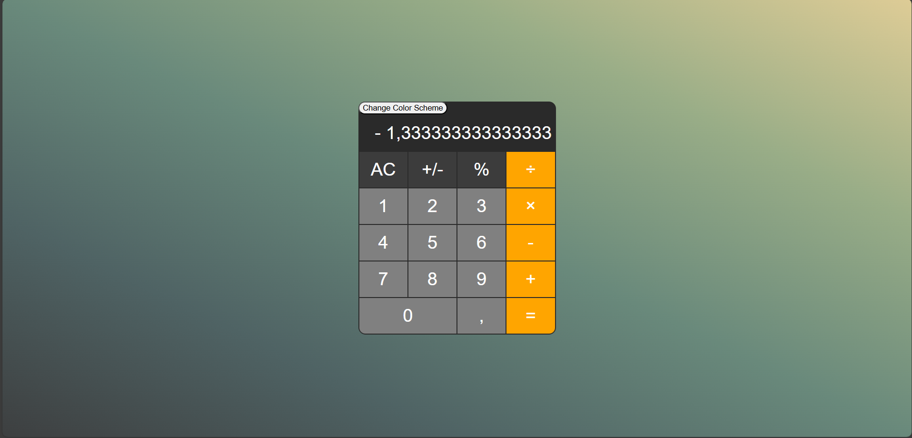
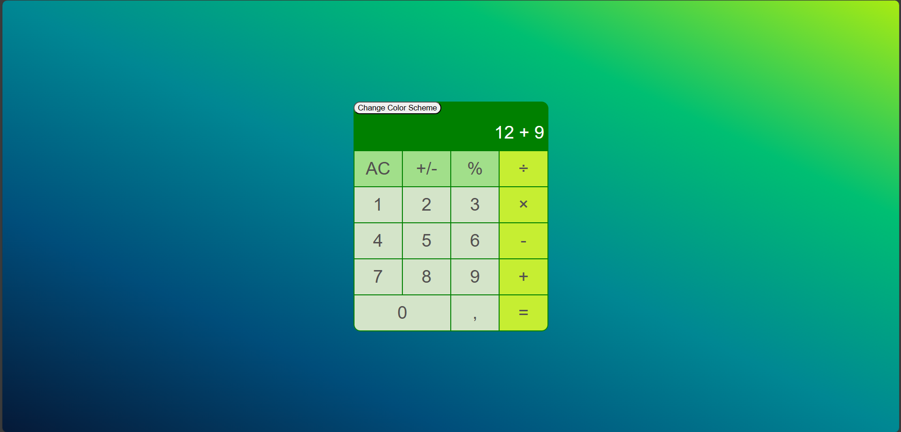

# Calculator

## Task:

You can get the full task by this [link](https://docs.google.com/document/d/1zpXXeSae-BlcxPKgw3DhxZA92cspVailrPYoaXSYrW8/edit?tab=t.0).

Deployed project by [link](https://moicalculator.netlify.app).

## Steps to install:

    - npm run build (to build bundle in directory dist/ index.html and index_bundle.js)
    - npm run start (deploy webpack server for development)

## Screenshots:

gruvebox theme

lime theme

